# Loci

> Persistent memory infrastructure for AI agents.

## What is Loci?

Loci gives AI agents the ability to remember. Most agent frameworks treat memory as an afterthought — a context window, maybe a vector store. Every run starts from zero.

Loci fixes that by providing a structured memory layer that persists across sessions, learns from past runs, and retrieves context intelligently when agents need it.

The name comes from the *Method of Loci* — the ancient memory technique where information is stored at specific locations in a mental map, then retrieved by navigating that space. That's exactly what Loci does for agents.

## Core Architecture

- **Working Memory** — typed, queryable state that persists within and across sessions
- **Episodic Memory** — retrievable logs of past runs; what the agent tried, what failed, what succeeded
- **Semantic Memory** — distilled generalizations extracted from episodes; learned rules, not raw logs

## Why Loci?

| Without Loci | With Loci |
|---|---|
| Agent repeats same mistakes | Agent learns from past failures |
| No context between sessions | Full history queryable at runtime |
| Raw vector similarity retrieval | Context-aware, state-sensitive retrieval |
| Every run starts from zero | Agents compound knowledge over time |

## Tech Stack

- **Cloudflare Workers** — serverless memory API layer
- **Cloudflare D1** — structured episodic and semantic memory storage
- **Cloudflare Vectorize** — semantic similarity retrieval
- **Cloudflare Durable Objects** — real-time working memory state

## Status

🚧 Active development — Stanford CS153 Final Project, Spring 2026

## Author

Mrityunjay Kumar — Stanford University, CS '28
